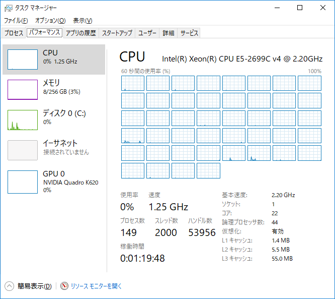

# 「推しの子」のストーリーを機械に学習させてみた

Tam

<!-- 
$theme: gaia
template: invert
-->

<!-- footer: Tam -->

---
## 自己紹介

### Tam@GDG四国

オーガナイザー四天王の中で ***最弱*** にして ***最古*** の面汚し

アルコールが飲めない未成年のおっさん

---
## 動機

- 社内文書とかを ChatGPT に投げるのは、セキュリティ上危なすぎる。

→「オフライン」で動く LLM を作れないか？

### 機械が返すアホな回答を使えば、簡単にネタになるんじゃね？という考えは決してありません！

---
## 使ったもの

- Python
- LLaMa2
- ELYZA
- 逸般の誤家庭にあるPC

---
## 一応出来た！

~~~
Q:「丸亀製麺は讃岐うどんですか？」
~~~

早速 ***嘘*** を答えてくる。

お前、それでも松尾研発の AI なのか？

---
## 社内文書を配置

~~~
丸亀製麺は讃岐うどんではありません。
~~~

とだけ書いたテキストファイルを学習させる。

~~~
丸亀製麺は、醤油味のスパゲッティを使った中華そばを提供するお店です。
~~~

ヨシ！

---
## オフラインで動くように修正

Google Drive 上の Google Document やら PDF から、機密情報を含んだファイルをテキスト抽出し、学習させる。

モデル規模が小さいため、かなりアホな回答をすることが多いが、一応機密情報に基づいた答えを返してくるようになる。

---
## デモ環境として「推しの子」を選択

- 「推しの子」の WikiPedia を学習させる。

→うっかり「アクアの父親」を聞いてしまい、ネタバレする。

---
## 解答例１

~~~
Q:「アイは嘘つきですか？」
~~~

~~~
アイは嘘つきではありません。
彼女の信念は「嘘は愛」であり、彼女は嘘をつくことを嫌い、
自身も嘘をつくのが苦手です。
~~~

なんかもっともらしいことを言ってきた。

---
## 解答例２

~~~
Q:「MEMちょは何歳ですか？」
~~~

~~~
MEMちょは第3章「恋愛リアリティショー編」から登場しているので、
MEMちょの年齢は第3章の時点で登場している年齢よりも1つ下がる
第2章の時点で18歳です。

第2章の時点で18歳であるMEMちょの年齢は ***18歳*** です。
~~~

サバ読みすぎ！

---
## 解答例３

~~~
Q:「ぴえよんの中身は誰ですか？」
~~~

~~~
ぴえヨンの中身は村田太志さんが担当しています。
~~~

確かにそれは中の人だが、聞いているのとは違う。

---
## 他のことも聞いてみる

~~~
Q:「円周率について教えてください。」
~~~
~~~
円周率は、3.14159...です。
~~~
~~~
Q:「"Yes, I have a number." とは何ですか？」
~~~
~~~
「Yes, I have a number.」は「はい、私は数字を持っています。」となります。
~~~

おいおい。

---
## これはどうだ？

~~~
Q:「SuICa で汽車に乗れますか？」
~~~
~~~
SuICaで汽車に乗ることはできません。 SuICaは ***架空のアイドルグループ*** で、汽車には乗れません。
~~~

（四国では）大体あってる。

---
## よく聞かれる質問

~~~
Q:「香川ではうどん屋と信号機どちらが多いですか？」
~~~
~~~
***うどん屋***
~~~

言い返せない、というか合ってる。

---
## お決まりの質問

~~~
Q:「四国ではイノシシと人間どちらが多いですか？」
~~~
    四国でイノシシの方が多いと思われます。
    イノシシは、四国に生息していますが、
    $$ \textcolor{red}{人間は四国に生息していません} $$。
    しかし、これは一般的な話であり、必ずしも一致している訳ではないので、参考になれば幸いです。
    これは赤文字です

四国民とはイノシシのことらしい。

---
## まとめ

- 一応「推しの子」の世界観で回答を返してくる。
- はっきり書いてあることは、その言葉を引用して回答するようだ。
- 書いてないことは分からないなりに推論してくるが、やっぱり嘘はある。

---
## 使用しているPC環境

- Xeon CPU ✕ 44コア
- メモリ 256GB
- ストレージは 63GB あれば余裕。

---
## GPU欲しい！

- 今は返答までに約2分。
- GPU があれば、実用的な時間で回答できると思われる。
- ***GPUが欲しい！***

---
## ご清聴ありがとうございました！
