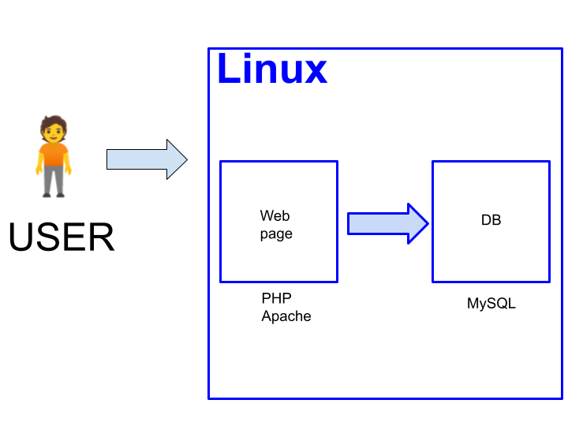

# JavaScript 入門講座

JavaScript 第１回 / 全６回

<!-- 
$theme: gaia
template: invert
-->

<!-- footer: JavaScript 入門講座 第１回 -->

---
## 様々な開発言語

- プログラムを書くための言語は何種類もあります。

- それぞれに一長一短があり、得意な領域や不得意な領域を抱えています。

- 通常は, それぞれの得意領域を組み合わせて複数の言語でシステムを作り上げます。

- すべてを理解するのは到底不可能なので、各言語に特化した複数の人がチームになってシステムを組み上げます。

---
## 言語の例

- Java

Android などの開発言語としてもてはやされている。出た当初はクライアント側での動作がメインだったが、サーバー側で動くプログラムも結構出てきている。

- Ruby

日本人が開発した言語。主にサーバーサイドで DB を扱うプログラムに長けている。

- C言語

歴史的に古い言語だが, ハードウェアに近いプログラムがほぼこの言語で書かれている。

---
## LAMP 環境

以下の環境でシステムを構築するのがデファクト・スタンダードになっている。

- Linux

OS に Linux を採用する。

- Apache

古くからある Web サーバであり, 使いやすく堅牢な性能を誇る。

- MySQL

オープンソースで開発されている DB サーバ。

- PHP

バックエンド（サーバー側）のプログラムとしてプラットフォームやライブラリが整備されており、多くの開発者にとって馴染みのある言語となっている。

---
## LAMP 構造

---
## JavaScript とは？

---
## 練習

まずは HTML から練習しましょう。

すべて「半角」で入力してください。

~~~sample0000.html
<html>
<head>
</head>
<body>
    <h1>Hello World</h1>
</body>
</html>
~~~

※「全角」（日本語入力モード）は使わないでください。

---
## HTML の構造

~~~sample0000.html
<html>
<head>
</head>
<body>  ← 開始タグ
    <h1>Hello World</h1>
</body>  ← 終了タグ
</html>
~~~

---
## シングルタグ

~~~sample0000.html
<html>
<head>
</head>
<body>
    <h1>Hello World</h1>
</body>
</html>
~~~

---
## 属性(attribute)

~~~sample0000.html
<html>
<head>
</head>
<body>
    <a href="http://www.google.co.jp">Google</a>
</body>
</html>
~~~

---
### 百聞は一見にしかず、習うより慣れろ

というわけで JavaScript を動かしてみましょう。

JavaScript はブラウザでも動かせます。次のページにサンプルがありますので、 HTML ファイルとして入力して、実際に動かしてみてください。

※コピー＆ペーストを活用してください。

---
## sample0010.html

~~~sample0010.html
<html>
<head>
    <meta charset="UTF-8">
    
</head>
<body>
</body>
</html>
~~~

---
## 時計を表示してみましょう。

~~~sample0020.html
<html>
<head>
    <meta charset="UTF-8">
    
</head>
<body>
</body>
</html>
~~~

---
## JavaScript 部分を別ファイルに分離してみましょう。

~~~sample0030.html
<html>
<head>
    <meta charset="UTF-8">
    
</head>
<body>
</body>
</html>
~~~

~~~sample0030.js
let d = new Date();
let h = d.getHours();
let m = d.getMinutes();
let s = d.getSeconds();
document.writeln(h + "時" + m + "分" + s + "秒");
~~~

---
## エラーが出たとき

ブラウザだと、デバッグコンソールでエラーが表示できます。

おかしな挙動が出てきたら、エラーを確認するようにしましょう。

~~~sample0031.js
let tmp = 6 / 0;
document.writeln(tmp);
~~~

---
## コメントの書き方

~~~sample0040.js
// 現在時刻を求める。
let d = new Date();

let h = d.getHours(); // 時
let m = d.getMinutes(); // 分
let s = d.getSeconds(); // 秒
/*
    時刻を表示する。
*/
document.writeln(h + "時" + m + "分" + s + "秒");
~~~

---
## 繰り返し文

1 から 10 までの数の和を求めましょう。

~~~sample0050.js
let result = 1 + 2 + 3 + 4 + 5 + 6 + 7 + 8 + 9 + 10;
document.writeln(result);
~~~

~~~sample0051.js
let result = 0;
for (let i = 1; i <= 10; i++) {
    result = result + i;
}
document.writeln(result);
~~~

---
## 公式を使う

~~~sample0060.js
let reuslt = 10 * 11 / 2;
document.writeln(result);
~~~

次に、 1 から 20 までの数の和を求めてください。

~~~sample0061.js
let reuslt = 20 * 21 / 2;
document.writeln(result);
~~~

---
## 関数

同じことをする部分をまとめます。

~~~sample0070.js
function sum(num) {
    let result = num * (num + 1) / 2;
    return result;
}

let result = sum(100);
document.writeln(result);
~~~
