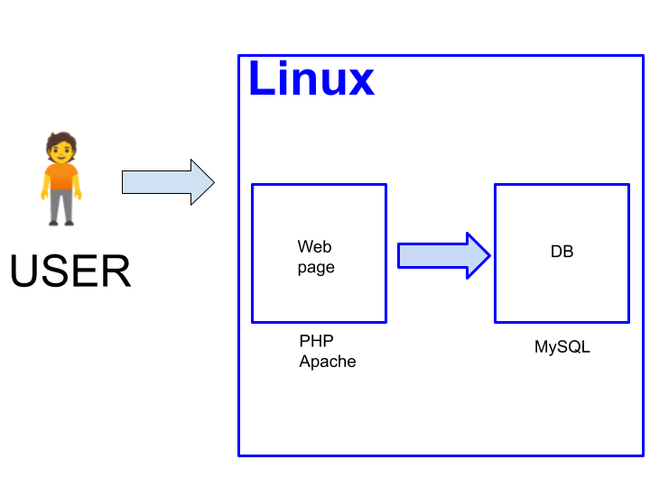

# リスキリング

JavaScript 第３回 / 全６回

<!-- 
$theme: gaia
template: invert
-->

<!-- footer: JavaScript 入門講座 第３回 -->

---
## おさらい（LAMP環境）

---
## フロントエンドとバックエンド

- 今までやってきた JavaScript は主にフロントエンド（ブラウザ上）で動かすための環境です。
- 今まで書いてきた HTML や JavaScript はローカルに保存されてました。
- これらをインターネット上に公開するためには、サーバーが必要です。
- サーバー上の HTML や JavaScript をユーザーのブラウザへ配信するための環境をバックエンドと呼びます。

---
## フロントエンドで出来ること

- クライアント（ブラウザ側）の見た目の変更
- ブラウザへ入力した内容のサーバーへの送信

## フロントエンドで出来ないこと

- 他の訪問者の情報や入力内容の閲覧、編集
- サーバー上の情報（データーベースなど）を書き換えること

---
## おさらい（HTML）

~~~sample0000.html
<html>
<head>
</head>
<body>
    <h1>Hello World</h1>
</body>
</html>
~~~

---
## JavaScript から HTML の書き換え（準備）

- HTML の書き換えたいタグに id="hello" を書き込みます。

~~~sample0301.html
<html>
<head>
    
</head>
<body>
    <h1 id="hello">Hello World</h1>
</body>
</html>
~~~

---
## JavaScript から HTML の書き換え

以下の JavaScript により、 "Hello World" の文字が "Good Morning" に書き換わります。

~~~sample0301.js
const element = document.getElementById('hello');
element.innerText = "Good Morning";
~~~

---
## 練習

1. SetTimeout 関数を利用して、 5秒後に文字が書き換わるようにしてみましょう。
1. 余力があれば、 5秒ごとに "Hello World" と "Good Morning" の表示が入れ替わるようにしてみましょう。

---
## HTML の挿入

以下のようにすると、 HTML タグも書き換えることが出来ます。

~~~sample0302.js
const element = document.getElementById('hello');
element.innerHTML = "Good Morning";
~~~

- タグを文字列で書き換えるよりも効率の良い方法があります。

---
## 木構造

- 根から葉へと木が先端に行くまでの経路と似ているので、以下のようなデーター構造を「木構造」と言います。
- HTML は木構造。

~~~
html
├ head
└ body
　　└ h1
　　　　└ "Hello World"
~~~

---